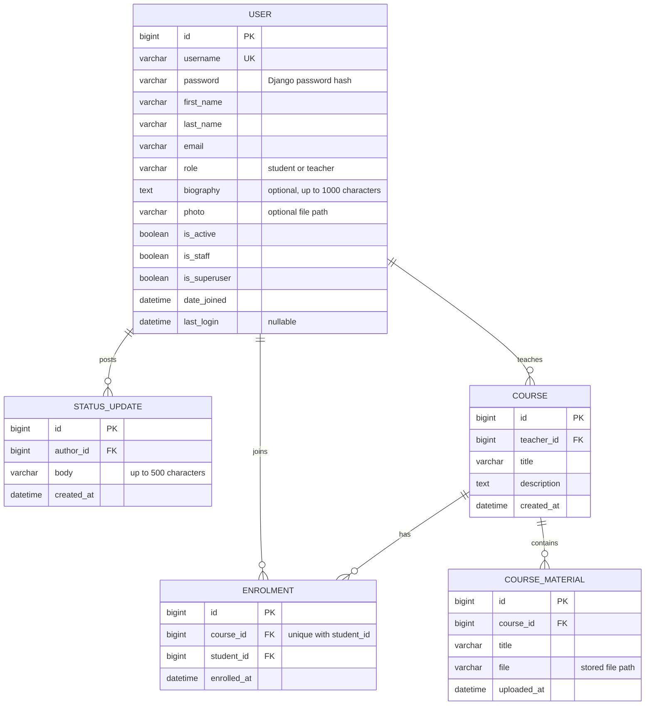

# Studyroom — CM3035 Final Coursework

> Draft status: accounts, profiles and course enrolment/materials implemented. Feedback, search, moderation, notifications, chat, REST endpoints and deployment are still pending. This note tracks work remaining and is not part of the submission text.

## 1. Introduction and development approach

Studyroom is an eLearning application being built with Django. The coursework requires student and teacher accounts, course enrolment and materials, feedback, notifications, a user REST interface and real-time chat. The first development step establishes accounts and authentication, since the later features need to know who is making a request and what that person may do.

Development started with the project skeleton, then the custom user and migration, registration, and login/logout. The teacher student list provided the first place to test different permissions. The browser pages use Django templates and forms, with views in `views.py` and registration validation in `forms.py`.

The next step added member home pages and biography editing. Photo uploads followed once the editing workflow had ownership tests, then status updates added the first one-to-many relationship. These changes have separate migrations, so existing accounts receive the new optional fields without needing to be recreated.

Courses were built in three steps: creation and browsing, enrolment and rosters, then uploaded materials. This order gave each upload a course to belong to and an established permission rule for downloading it. The course work also exposed a repeated home-page context between normal viewing and an invalid status submission; a small helper now supplies the same course information to both.

## 2. Accounts and database design

The first model is `accounts.User`, which extends Django's `AbstractUser`. It retains Django's username, password, name and email fields and adds a `role` field with two values: student and teacher. One field makes the two account types mutually exclusive. The field choices validate form input; a database check constraint also rejects other role values when a write bypasses a form.

I used a custom user because the role belongs to the account and is needed whenever permissions are checked. `AbstractUser` keeps the standard authentication behaviour while allowing the additional field [1]. Configuring it before the first migration avoids replacing the user table once other models reference it. The admin extends `UserAdmin`, including the role on both its creation and editing forms.

To keep role values and their display labels together, I used `TextChoices`. A `CheckConstraint` enforces the two-value rule in SQLite, including writes made outside a form. The views then check the stored role to decide whether the user can perform an action.

Profile data stays on `User`: a biography of up to 1,000 characters and an optional photo. Both describe one account, so a separate profile table would add a join without a separate lifecycle to manage. The photo column stores a file path; the image itself is saved under `MEDIA_ROOT`.

Status updates belong in their own table because an account can post many of them. Each `StatusUpdate` stores its author, text and creation time. The author's name is read through the foreign key rather than copied into every update, so a name change does not leave old posts with stale names. Deleting an account cascades to its updates, which have no purpose without their author. The default ordering uses creation time and then primary key, both descending, so updates have a consistent order even when timestamps match.

`Course` has one teacher, a title, a description and a creation time. Its teacher uses `PROTECT`: deleting a teacher should not silently remove courses that students have joined. The teacher's name is retrieved through the relationship. Titles are not unique, since different teachers can reasonably offer courses with the same title; URLs identify courses by primary key.

`Enrolment` links a student and a course and records when they joined. A unique constraint on the pair prevents duplicate participation, including writes outside the web form. Keeping the enrolment as a record also leaves a place for the removal and blocking state in the next step. Course and student deletion cascade to their enrolments. Model validation checks the account role for course owners and enrolments; the web views separately enforce the role and assign the account from the session.

`CourseMaterial` stores a title, file path, upload time and course foreign key. The owning teacher is already available through the course, so it does not repeat that account reference. This structure keeps account details, course descriptions and individual materials in their respective tables, while enrolment represents the many-to-many student/course relationship.

The ER diagram shows these application fields and relationships. Django's supporting authentication and session tables are omitted.



## 3. Registration, authentication and permissions

Public registration creates student accounts. Teacher accounts are created or promoted through the admin, because letting a registrant choose teacher would also let them grant themselves access to student records. The registration form extends `UserCreationForm` and explicitly lists username, first name, last name and email. It does not accept role or administration flags. The password fields and validation come from Django. After saving a valid account, the view redirects to login and displays a confirmation; invalid input returns the bound form with field errors.

Login and logout use Django's built-in views and session authentication. Logout is a POST form with a CSRF token. Keeping the built-in login view also preserves its validation of the `next` destination: a user can return to a requested local page without the application redirecting them to an arbitrary external address supplied in the request.

The first teacher function is a paginated list of active student accounts. It shows username and real name, but not email or password information. Anonymous requests go to login; authenticated students receive 403. The template hides the student-list link from students, but the view checks the role independently, so entering the URL directly does not bypass the restriction. Teacher status is separate from `is_staff`: teachers have application permissions, while the staff flag controls entry to Django admin.

The list covers active students across the site. To keep the table manageable as accounts are added, I used Django's `Paginator` to divide it into pages of 25. Since the page only displays records, `require_safe` limits it to GET and HEAD requests. The forms use `as_div` to render Django's fields and errors inside containers styled by the stylesheet.

## 4. Profiles, discovery and status updates

The Members page gives students and teachers a way to find each other's home pages. It lists active accounts, excluding site administrators from the directory. Each home page shows the member's name, username, role, biography, photo and status history. These pages require login. Email addresses remain account information and are not rendered on the directory or another member's home page. This separates profile discovery from the teacher-only student list and its later course-management functions.

Profile editing has one route, `/accounts/profile/edit/`, with no target account ID. The view passes `request.user` as the form instance, so editing always applies to the logged-in account. The form lists the editable fields explicitly. Submitting an extra username, role, email or administration flag does not change it. Successful edits redirect to the member's home page; invalid edits return the form and errors without saving the profile.

Photos use an `ImageField` and Pillow to check image content. The upload form uses `multipart/form-data`, and the view passes `request.FILES` alongside `request.POST` [3]. I limited uploads to JPEG and PNG, 2 MB, and 4096 pixels on either side to keep profile images reasonably bounded. Checking the content as well as the extension rejects a GIF renamed to `.png`. The shared field validator also applies when the model is validated through an admin form. It rewinds the file after inspecting it so storage can read the complete upload.

The photo URL identifies the account, and a Django view checks login and account activity before returning a `FileResponse`. The application does not expose a general `/media/` route. `never_cache` adds response headers telling browsers not to retain the authenticated image response. Removing a photo clears the current reference; trying to remove and replace it in the same submission returns an error rather than choosing one action silently. A review found that the admin's default file widget still linked to `/media/`, so its current-photo link was changed to use the authenticated route too.

Both students and teachers can post updates on their own home page. This covers the brief's student example and R1(i), which refers to users adding updates. A `ModelForm` validates non-blank text up to 500 characters. Only the text is accepted from the form: the view assigns the author from `request.user` before saving. Posting requires POST and a CSRF token. Status history is paginated in groups of ten, newest first. If validation fails, the existing updates remain visible alongside the error. Biography and status text use Django's template escaping, so submitted HTML is displayed as text.

The interface uses a shared template, labelled form fields and a small stylesheet. Members have a direct My home link, while other users' pages show neither the edit link nor the status form. Long text wraps inside the page, and the photo is displayed at a fixed size without stretching its aspect ratio. No JavaScript is needed for these forms.

## 5. Courses, enrolment and materials

Members can browse course descriptions before joining. Teachers create courses through a `ModelForm` exposing only title and description; the view assigns the teacher. Students enrol with a CSRF-protected POST. `get_or_create` and the unique database constraint make a repeated submission return the existing enrolment instead of creating another one. My courses shows the teacher's own courses or the student's enrolments, depending on role.

The roster view checks that the requester is a teacher and retrieves the course filtered by that teacher. A different teacher cannot get a roster by changing the URL. Even enrolled students cannot open the roster. On home pages, teachers' courses are discoverable, while a student's enrolments are shown only to that student. These are different views of the same course relationships, rather than separately stored lists.

Materials are uploaded by the course teacher. The form accepts a title and file, and the course comes from the authorised URL lookup rather than a submitted field. Downloads check the same owner/enrolment rule used to show the material list. Knowing a material ID or storage path is insufficient to retrieve it. The response sends the file as an attachment and disables caching. Course descriptions remain visible to unenrolled members, but material titles and links do not.

I used Pillow for JPEG/PNG checks and added `pypdf` to read PDF structure, rather than treating a `.pdf` extension as proof of a valid document. The PDF reader uses strict mode and requires an unencrypted document with at least one page [4]. Images must match their extension and fit within 4096 by 4096 pixels. All materials have a 10 MB limit. These checks reject unsupported, malformed and oversized uploads; they are not malware scanning. Strict PDF parsing can also reject a damaged document that a viewer would repair, so the user may need to export a clean copy.

Course logic lives in the `courses` app. The HTML views remain short functions; the shared `can_view_materials` helper prevents the course page and download endpoint from making different permission decisions. Course lists, rosters and materials are paginated. `select_related` retrieves teacher/student details with the corresponding rows rather than issuing another query for each displayed name.

## 6. Photo cleanup

The first upload implementation left replaced photos on disk. During the file-handling work I added cleanup using user-model signals, so it also covers admin saves and queryset deletion. Before a save, the previous file name is remembered; after a successful save, a changed reference schedules cleanup. Account deletion schedules the same check.

Deletion uses `transaction.on_commit`: if a database transaction rolls back, its deletion callback is discarded [5]. Before deleting a file, the callback checks whether any account still references its name. This protects a shared file and leaves unrelated users' uploads alone. Cleanup errors are logged through the robust callback option, so a storage failure does not make an already-saved profile look like a failed edit. Direct queryset updates bypass these save signals and should not be used to replace photos.

## 7. Testing

The suite has 108 tests across account, profile, photo-cleanup, course and material test files. All run with `python manage.py test`. They use DRF's `APITestCase` and factory_boy, following the test structure from my midterm. The routes tested here return HTML. Factories provide predictable names and passwords, and each test overrides the values relevant to its case. The factory's `Password` helper hashes the test password so the login tests exercise real authentication.

Registration tests check stored names and email, password hashing, duplicate usernames, missing fields and invalid passwords. A tampered request includes a teacher role and both admin flags, then checks that the resulting account is still an ordinary student. Authentication tests cover both roles, incorrect credentials, inactive accounts, permitted local redirects and rejection of an external redirect. Logout tests check that GET does not end the session and that POST does.

The normal test client does not enforce CSRF. Separate cases therefore use `APIClient(enforce_csrf_checks=True)` to check rejected requests without tokens and successful registration/logout with tokens. Permission tests exercise anonymous and student requests to the student list, including a student with the staff flag. They also check that teachers cannot enter admin, inactive students are excluded, private fields are absent and pagination does not repeat rows between pages. The admin creation test submits the actual teacher form. A direct database write with an invalid role checks the constraint independently of form validation.

Profile tests submit another account's ID and privileged fields to the editing route, then check that only the logged-in user's permitted fields changed. Upload tests create small images in memory and use a temporary media directory, so the test run does not leave files among real uploads. They cover valid JPEG/PNG files, non-images, misleading extensions, oversized files and dimensions, replacement, removal and authenticated delivery. Failed replacement must preserve the previous image and biography.

Status tests check both roles, a forged author, blank and overlong input, the 500-character boundary, escaped HTML, history ordering, pagination and deletion of an author. Separate CSRF checks exercise profile editing and status posting with enforcement enabled.

Course tests cover forged owner/student fields, duplicate enrolment at both HTTP and database levels, teacher/student restrictions, isolated rosters and home-page course visibility. Material tests check valid PDFs/images, malformed files, misleading extensions, encrypted PDFs, size limits and complete download bytes. They also test direct requests from outsiders and loss of download access after an enrolment is deleted.

Photo cleanup tests execute captured commit callbacks to verify replacement, removal and account deletion. Other cases roll back an edit, update an unrelated field, submit an invalid form or share a file between two accounts. The expected result is checked on storage as well as in the database. All 108 tests passed after these changes. Django's system check passed, and migration checks remain part of each schema change.

A Chrome walkthrough exercised course creation, PDF upload, student enrolment, downloading and the teacher roster. A separate student account received HTTP 403 when requesting the file directly without enrolment. Desktop and mobile screenshots were inspected, and layout checks covered widths of 320 and 390 pixels. A 150-character title without spaces caused horizontal scrolling on mobile; allowing the heading to wrap fixed it. This is a focused browser check, not a complete accessibility or cross-browser audit.

## 8. Current local setup

The project uses a separate Python 3.12.9 environment. Installed direct dependencies are Django 5.2.17, djangorestframework 3.18.1, factory_boy 3.3.3, Pillow 12.3.0 and pypdf 6.18.1. Pillow was added with photo uploads and pypdf with course materials. Django 5.2 was selected as the supported LTS alternative to the originally proposed 5.1 series [2]. Exact release dependencies will be captured in `requirements.txt` for the clean-install rehearsal.

From the project directory, activate the existing local environment and run:

```sh
source .venv/bin/activate
python manage.py migrate
python manage.py runserver
```

Open `http://127.0.0.1:8000/`. Registration is at `/accounts/register/`, login at `/accounts/login/`, the teacher student list at `/students/`, and administration at `/admin/`. Run the tests with `python manage.py test`; no demo-data loading is required for tests.

After login, Members opens `/members/` and My home opens the current user's `/members/<id>/` page. Edit my profile allows name, biography and photo changes; the status form is on the home page. Log in as another member to see the shared information without editing controls. Uploaded photos are stored in `media/profiles/`, which is excluded from Git but must be preserved when copying the populated application.

Courses opens `/courses/`; My courses opens `/courses/mine/`. A teacher can create a course, then upload its materials and view its roster from the detail page. A student sees an Enrol button until they have joined, after which the materials become available. Course files are stored in `media/course_materials/` and must also be included when copying the populated application.

The demo course, Database practice, belongs to morgan and contains a sample PDF called Week one exercise. alex is enrolled; sam is not, allowing both download permission cases to be tried.

The local database currently contains these demonstration accounts:

| Username | Account |
| --- | --- |
| alex | Student, Alex Wood |
| sam | Student, Sam Reed |
| morgan | Teacher, Morgan Shaw |
| admin | Site administrator |

Their local demonstration password is `Studyroom-demo-482!`. They were created through Django's user model, with `set_password` used to store hashed passwords. A repeatable loader will be introduced once the course demo data has a settled shape. The database is excluded from Git but will be included, together with the required media, in the submission ZIP. The virtual environment will be excluded from that ZIP.

## 9. Deployment plan

> Planning note: deployment follows integration testing. Compare hosts for ASGI/WebSocket support, Redis, a Celery worker, persistent storage and cost. Record the chosen configuration and verify HTTPS/WSS, permissions, uploads and persistence across restarts. No host has been selected or deployment carried out.

## References

1. Django documentation, [Substituting a custom User model](https://docs.djangoproject.com/en/5.2/topics/auth/customizing/#substituting-a-custom-user-model).
2. Django, [Supported versions](https://www.djangoproject.com/download/#supported-versions).
3. Django documentation, [File uploads](https://docs.djangoproject.com/en/5.2/topics/http/file-uploads/).
4. pypdf documentation, [PdfReader](https://pypdf.readthedocs.io/en/stable/modules/PdfReader.html).
5. Django documentation, [Performing actions after commit](https://docs.djangoproject.com/en/5.2/topics/db/transactions/#performing-actions-after-commit).

## 10. Critical evaluation

The account foundation reuses Django's password and session handling, leaving a small amount of application-specific code to inspect. The tests demonstrate that the role difference is enforced on a real page and cannot be selected through registration. Using one role field is sufficient for the coursework's two account types, but it would need reconsideration if a person could teach some courses and attend others as a student.

Creating teachers through admin prevents self-assignment of teacher privileges, but each new teacher needs an administrator's action. Email format is checked, but ownership of the address is not verified. Login also has no application-level rate limiting. First and last names are required by registration but remain optional on the admin form, so an administrator can create incomplete records. These are limits to address before using the account workflow for real students.

Serving photos through Django keeps member access checks in one place, but makes the web process handle each image request. A larger deployment would need to measure that cost before choosing a different delivery method. Upload limits are validated after Django receives the request; they do not replace request-size limits at the production web server.

Old profile photos are now deleted after committed replacement/removal, but the database and filesystem are still separate systems: a failed storage operation or a newly uploaded file followed by transaction rollback can leave an orphan. A periodic reconciliation would be useful for a deployed application. Course-material replacement/deletion through admin also leaves its old files on disk; there is no user-facing material replacement workflow yet. Images are validated but not resized or stripped of metadata. Status updates can be posted and read, but users cannot yet edit or delete individual posts; the admin can manage them.

Each course has one teacher and is available for enrolment as soon as it is created. There is no draft/published state, capacity limit or student withdrawal flow. This covers the current coursework workflow with a small schema, but a real teaching service would need to decide those policies. Role checks in model validation do not run on arbitrary ORM saves; the current web paths assign roles and relationships explicitly, while admin changes still require care. SQLite is sufficient for the local demonstration, but the sequential duplicate-enrolment tests do not establish behaviour under concurrent write load.
