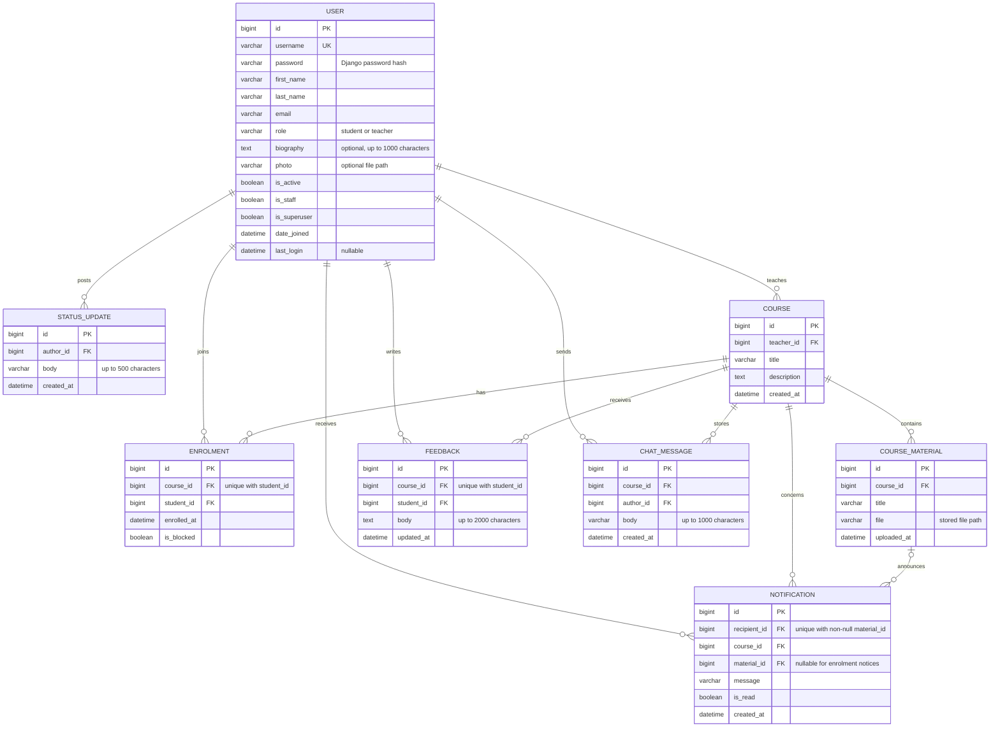

# Studyroom — CM3035 Final Coursework

## 1. Introduction and development approach

I built Studyroom as a Django eLearning application. I needed to cover student and teacher accounts, courses, materials, feedback, notifications, a REST interface and real-time chat. I started from accounts and authentication because every later feature needed to know who was making the request and what that user was allowed to do.

I created the project skeleton first, followed by the custom user model and migration, registration, and login/logout. I used the teacher student list as the first place to prove that the two roles had different permissions. For the browser pages I used Django templates and forms, with normal views in `views.py` and registration validation in `forms.py`.

Next I added member home pages and biography editing. I added photo uploads after the editing workflow had ownership tests, then status updates introduced the first one-to-many relationship. I kept these changes in separate migrations so I could update existing accounts without recreating them.

I built courses in three steps: creation and browsing, enrolment and rosters, and finally uploaded materials. This order meant that every upload already had a course and an established download rule. During this work I found repeated home-page context in the normal view and the invalid status form path, so I moved that small piece into a helper.

I added teacher search to the existing member directory, then feedback for enrolled students and the remove/block controls on the roster. Blocking made me revisit downloads and home-page queries because an enrolment row could now mean that access was blocked. I could no longer treat the existence of that row as enough evidence of access.

## 2. Accounts and database design

I made `accounts.User` extend Django's `AbstractUser`. This kept Django's username, password, name and email fields, while I added a `role` with the two allowed values, student and teacher. One field makes the account types mutually exclusive. I used field choices for form validation and a database constraint for writes which bypass a form.

I used a custom user because the role belongs to the account and is needed for permissions. `AbstractUser` gave me the normal Django login fields while still letting me add the role. I did this before the first migration because changing user models later would have caused problems with the related tables. I also added the role to the normal Django admin forms.

I used `TextChoices` to keep each role value beside its display label. I also added a `CheckConstraint` so SQLite rejects another value even if the write happens outside a form. I then check the stored role in the views before allowing an action.

I kept the biography and optional photo on `User` because both belong to exactly one account. A separate profile table would add another join without giving this data a separate lifecycle. The photo column stores its path, while the file is saved under `MEDIA_ROOT`.

I placed status updates in their own table because one account can post many updates. Each `StatusUpdate` stores the author, text and creation time. I read the author's name through the foreign key instead of copying it, so changing a name also changes how old posts are displayed. I used cascade deletion because an update has no purpose without its author, and I ordered updates by creation time and primary key so ties are predictable.

For `Course`, I stored one teacher, a title, a description and the creation time. I used `PROTECT` for the teacher because deleting an account should not silently delete a course which students joined. I did not make titles unique because two teachers could reasonably use the same title; the URL uses the primary key.

I used `Enrolment` to join a student and course and record when they joined. A unique constraint on the pair stops duplicate enrolment. I added `is_blocked` with a false default so the migration preserved existing rows. A blocked row prevents re-enrolment, while removal deletes the row. I validate account roles in the model and still enforce them in the web views, where the account comes from the session.

In `CourseMaterial` I stored the title, file path, upload time and course foreign key. I did not repeat the teacher because it is already available through the course. This keeps account, course and material data in their own tables, while enrolment represents the student/course many-to-many relationship.

For `Feedback`, I stored the student, course, text and last update time. I made the student/course pair unique to give each student one editable entry. I reference both records directly, so removing an enrolment does not erase earlier feedback. I limited the text to 2,000 characters and did not add a rating because the requirement only asks for written feedback.

I made each `ChatMessage` belong to a course and author. The course already identifies the chat room, so I did not add a separate room table. I assign the sender from the authenticated session rather than submitted JSON.

I show these fields and relationships in the ER diagram below. I left out Django's supporting authentication and session tables so the application model stays readable.



## 3. Registration, authentication and permissions

I made public registration create student accounts only. I create or promote teachers through the admin, because a teacher option on the public form would let anybody give themselves access to student records. I extended `UserCreationForm` and explicitly listed username, first name, last name and email. I left the password fields and validation to Django and did not accept role or administration flags.

Login and logout use Django's built-in views and session authentication. Logout is a POST form with a CSRF token. Keeping the built-in login view also preserves its validation of the `next` destination: a user can return to a requested local page without the application redirecting them to an arbitrary external address supplied in the request.

The first teacher function is a paginated list of active student accounts. It shows username and real name, but not email or password information. Anonymous requests go to login; authenticated students receive 403. The template hides the student-list link from students, but the view checks the role independently, so entering the URL directly does not bypass the restriction. Teacher status is separate from `is_staff`: teachers have application permissions, while the staff flag controls entry to Django admin.

I used `login_required` on private pages, as shown in the lectures. I also used Django's method decorators: for example enrolment and status submission only accept POST. I had not used these in my midterm because that API was read-only, but they made sense once this project had forms which change data. The views still check the user's role and the course owner because the decorator only checks the request method.

The list covers active students across the site. To keep the table manageable as accounts are added, I used Django's `Paginator` to divide it into pages of 25. Since the page only displays records, `require_safe` limits it to GET and HEAD requests. The forms use `as_div` to render Django's fields and errors inside containers styled by the stylesheet.

## 4. Profiles, discovery and status updates

I added the Members page so students and teachers can find each other's home pages. I list active accounts but leave site administrators out of the directory. Each home page shows the member's name, username, role, biography, photo and status history. I require login and keep email addresses out of the directory and other members' pages.

I gave profile editing one route, `/accounts/profile/edit/`, with no target account ID. I pass `request.user` as the form instance, so an edit always applies to the logged-in account. The form lists the editable fields explicitly, which means an extra username, role, email or administration flag is ignored.

Photos use an `ImageField` and Pillow to check the uploaded image. The form uses `multipart/form-data` and the view handles `request.FILES`. I accepted JPEG and PNG files up to 2 MB and limited their dimensions. This was a practical way to avoid very large or wrongly named files without making the upload feature too complicated.

I return photos through a Django view rather than exposing the whole media folder. This means the user must be logged in to request one. Users can replace or remove their own photo from the edit form. If both choices are submitted together, the form asks them to choose one action.

Both students and teachers can post updates on their own home page. I used a `ModelForm` for text up to 500 characters and assign the author from `request.user`. This was important because I did not want the browser form to decide which user wrote a post. The newest updates appear first and are split into pages of ten.

The interface uses a shared template, labelled form fields and a small stylesheet. Members have a direct My home link, while other users' pages show neither the edit link nor the status form. Long text wraps inside the page, and the photo is displayed at a fixed size without stretching its aspect ratio. No JavaScript is needed for these forms.

## 5. Courses, enrolment and materials

I let members browse course descriptions before joining. Teachers create courses through a `ModelForm` exposing only title and description, while the view assigns the teacher from the session. Students enrol with a CSRF-protected POST. I used `get_or_create` as well as the unique database constraint so a repeated submission returns the existing enrolment. My courses changes its result according to the member's role.

The roster view checks that the requester is a teacher and retrieves the course filtered by that teacher. A different teacher cannot get a roster by changing the URL. Even enrolled students cannot open the roster. On home pages, teachers' courses are discoverable, while a student's enrolments are shown only to that student. These are different views of the same course relationships, rather than separately stored lists.

I allow only the course teacher to upload materials. The form accepts a title and file, and I take the course from the authorised URL lookup instead of a submitted field. Downloads check the same owner/enrolment rule used for the material list, so knowing an ID or storage path is not enough. I keep descriptions public to signed-in members but hide material titles and links from unenrolled students.

For course materials I accepted PDF, JPEG and PNG files up to 10 MB. Pillow checks images and I used `pypdf` to make sure that a PDF can actually be read and contains a page. I added this after trying the upload with invalid files. It is still simple validation and is not intended to be virus scanning.

I kept the course logic in the `courses` app. A small `can_access_course` helper is shared by the course page, downloads and chat, otherwise I found myself repeating the same permission check. I also paginated the longer lists and used `select_related` where teacher or student names are displayed.

### Feedback and teacher search

An enrolled student can write or update feedback through a `ModelForm` exposing only the text. The course comes from the URL and the student from the session. `update_or_create` uses that pair to save an entry, so submitting the form again updates it. Feedback is visible to signed-in members browsing the course, including those considering enrolment, and the form explains this before submission. Output is escaped and paginated independently from materials. Removed and blocked students keep their existing feedback but cannot change it without active enrolment.

Teachers can search the Members page by username, first name or surname. I used Django `Q` expressions because one search word can match any of those three fields. I split a full name into words, which lets a search such as “Minerva McGonagall” match both first and last name. Students can browse the directory but only teachers can use its search function.

### Removing and blocking students

I interpreted removal and blocking as course-level decisions, since teachers manage their own rosters. They do not disable a student's account or affect another teacher's course. Removal deletes the enrolment and allows the student to join again. Blocking retains it with `is_blocked=True`, preventing re-enrolment, material access and feedback editing. Blocked records appear separately on the teacher's roster and are excluded from the student's home-page courses and My courses.

Each action has a confirmation page and only changes the record after a POST. I check that the teacher owns the course and that the enrolment belongs to it. Unblocking removes the blocked record, then the student can choose whether to enrol again. I kept existing feedback after removal because it belongs to the course review rather than the enrolment record.

## 6. Photo cleanup

The first upload implementation left replaced photos on disk. During the file-handling work I added cleanup using user-model signals, so it also covers admin saves and queryset deletion. Before a save, the previous file name is remembered; after a successful save, a changed reference schedules cleanup. Account deletion schedules the same check.

I used `transaction.on_commit` so the old photo is removed only after the database change succeeds. I also check that another account is not using the same file name. This is a small improvement beyond the basic upload example from the lectures, but I added it because repeated profile edits were leaving unused files in my media folder.

## 7. Notifications and background tasks

Enrolment creates one notification for the course teacher. The enrolment and notice are saved in the same database transaction, so they succeed or roll back together. A repeated enrolment submission returns the existing record and creates no second notice. Removing a student and letting them join again is a new enrolment and produces a new notice.

Material uploads can notify several students, so I used Celery and Redis to do this after the upload request, following the approach from the lectures. The view sends the material ID to the task. The worker then finds the active and unblocked students who were already enrolled and creates their notifications. A student who enrols afterwards can see the material normally but does not receive an old notification.

`Notification` stores the recipient, course, message, time and whether it was read. Material notifications also store the uploaded material. I made the recipient and material combination unique so retrying a task does not add the same notice twice. Enrolment notices have no material, so a student who is removed and later joins again can produce a new notice.

The Notifications page only queries records for the logged-in user and shows which ones are unread. Marking one as read uses a POST. Its link still goes through the normal course permissions, so an old notification does not give a removed student access.

I added a short retry for temporary database errors. During local development I also found that an unavailable Redis server made the upload fail, so the application falls back to creating the notices directly if it cannot publish the task. Normally the worker handles them in the background.

## 8. Course chat over WebSockets

I built chat in three small steps: first the Channels route and connection, then saved messages, and finally the browser page. Daphne serves the ASGI application and `/ws/courses/<id>/chat/` goes to the chat consumer. `AuthMiddlewareStack` lets the consumer use the same logged-in user as the normal website.

Each course has one chat room for its teacher and enrolled, unblocked students. I moved the course access rule into `permissions.py` so both the normal page and WebSocket use the same check. The consumer checks access when connecting and when handling messages. This also means that a removed or blocked student cannot continue sending messages from an already open page.

The consumer accepts messages up to 1,000 characters and saves them before sending the event to the Redis group. I used `database_sync_to_async` when the asynchronous consumer needs the Django ORM, as covered in the Channels material. Redis carries the live message while the database stores the history. The page loads the latest 50 messages when it connects.

The page chooses `ws://` locally or `wss://` under HTTPS, shows connection status and disables sending after disconnection. Reconnect reloads the page and its saved history. This small interface supports the required teacher/student conversation without introducing a separate frontend framework.

## 9. User REST interface

I placed the DRF views in `accounts/api.py` and the serializers in `serializers.py`, following the structure used in the lectures. All endpoints require login. The list and detail endpoints show the same public profile information as the website and leave out email, passwords and administrator accounts.

| Endpoint | Methods | Purpose |
| --- | --- | --- |
| `/api/users/` | GET | Shared member profiles, 20 per page |
| `/api/users/<id>/` | GET | One member's shared profile |
| `/api/users/me/` | GET, PATCH | Read your profile, including email; update name and biography |

The own-profile view gets its object from `request.user`, so submitted JSON cannot select another account. Its serializer only allows first name, last name and biography to change. I kept photo uploads on the HTML form because adding multipart uploads to this small API was not needed for the user-data requirement.

I added `drf-spectacular` because Swagger was part of the topics covered in class. The documentation is available at `/api/docs/` and the schema is at `/api/schema/`. I used its sidecar package so the Swagger page also works without loading files from a CDN.

## 10. Testing

I wrote 63 automated tests and run them with `python manage.py test`. I used DRF's `APITestCase` and factory_boy in a similar structure to my midterm. The factories give me predictable records and correctly hashed passwords. Upload tests use temporary storage, so running the suite does not change the demonstration files. Following the lecturer's advice, I selected only eight representative tests to discuss here:

1. Registration creates a student and ignores submitted teacher or administrator fields.
2. A profile edit and status post always use the logged-in member, even if another account ID is submitted.
3. Repeating an enrolment request does not create a duplicate record or a second teacher notification.
4. An unenrolled, blocked or unrelated user cannot view or download protected course material.
5. Feedback can only be written by an enrolled student, and a second submission updates the same entry.
6. Course removal and blocking are limited to that course's teacher and immediately change the student's access.
7. A WebSocket test uses Channels' `WebsocketCommunicator` to check authorised delivery and saved chat history; the surrounding socket tests cover access changes.
8. The REST test checks private-field filtering and confirms that a member can PATCH only their own allowed profile fields with CSRF protection.

The whole suite also checks validation and less common permission paths, but listing each case would repeat the code rather than explain my testing choices. I mock the Celery publisher where needed and use an in-memory channel layer, so Redis and a worker are not needed during tests. All 63 tests passed.

I also used separate teacher and student browser sessions for the full workflows. I tried uploads, enrolment, feedback, moderation, notifications and two-way chat. Reloading restored chat history, and blocking a student with their chat open stopped their next message. I checked the pages at a mobile width and used Swagger to update a temporary account while another member stayed read-only. These manual checks helped find integration and layout problems, but they are not a full accessibility or cross-browser audit.

## 11. Current local setup

My development environment was macOS 26.6.2 with Python 3.12.9. The main dependencies are Django 5.2.17, DRF 3.18.1, factory_boy 3.3.3, Pillow 12.3.0, pypdf 6.18.1, Celery 5.6.3, Channels 4.3.2, Daphne 4.2.3 and drf-spectacular 0.29.0. I used Django 5.2 because it is the supported LTS version. Psycopg connects the deployed PostgreSQL database, dj-database-url reads its setting, and WhiteNoise serves the collected static files. `requirements.txt` pins the complete package list below.

The complete package and version list is:

```text
amqp==5.3.1
asgiref==3.12.1
attrs==26.1.0
autobahn==26.7.1
Automat==25.4.16
billiard==4.2.4
cbor2==6.1.4
celery==5.6.3
cffi==2.1.1
channels==4.3.2
channels_redis==4.3.0
click==8.5.0
click-didyoumean==0.3.1
click-plugins==1.1.1.2
click-repl==0.3.0
constantly==23.10.4
cryptography==46.0.5
daphne==4.2.3
Django==5.2.17
dj-database-url==3.0.1
djangorestframework==3.18.1
drf-spectacular==0.29.0
drf-spectacular-sidecar==2026.9.1
factory_boy==3.3.3
Faker==40.38.0
hyperlink==21.0.0
idna==3.19
Incremental==24.11.0
inflection==0.5.1
jsonschema==4.26.0
jsonschema-specifications==2025.9.1
kombu==5.6.2
msgpack==1.2.2
packaging==26.3
pillow==12.3.0
prompt_toolkit==3.0.53
psycopg==3.2.10
psycopg-binary==3.2.10
pyasn1==0.6.1
pyasn1_modules==0.4.2
pycparser==3.0
pyOpenSSL==25.3.0
pypdf==6.18.1
python-dateutil==2.9.0.post0
PyYAML==6.0.3
redis==6.4.0
referencing==0.37.0
rpds-py==2026.6.3
service-identity==24.2.0
six==1.17.0
sqlparse==0.6.0
Twisted==26.4.0
txaio==26.6.1
typing_extensions==4.16.0
tzdata==2026.4
tzlocal==5.4.4
ujson==6.0.0
uritemplate==4.2.0
vine==5.1.0
wcwidth==0.8.3
whitenoise==6.11.0
zope.interface==8.6
```

Extract the supplied source archive, then create an environment and install the dependencies:

```sh
unzip Studyroom_Source.zip -d Studyroom
cd Studyroom
python3.12 -m venv .venv
source .venv/bin/activate
python -m pip install -r requirements.txt
python manage.py migrate
python manage.py runserver
```

For background material notifications, run Redis and a Celery worker in separate terminals. The worker command runs from the project directory with the virtual environment activated:

```sh
redis-server --bind 127.0.0.1 --dir /tmp --dbfilename studyroom-redis.rdb
```

```sh
celery -A studyroom worker --loglevel=INFO --pool=solo
```

The local worker uses one process and a `studyroom` queue. Chat shares Redis with a separate key prefix. Daphne is first in `INSTALLED_APPS`, so `manage.py runserver` serves ASGI and accepts WebSockets. Tests do not require Redis or Celery.

Open `http://127.0.0.1:8000/`. Registration is at `/accounts/register/`, login at `/accounts/login/`, the teacher student list at `/students/`, and administration at `/admin/`. Run the tests with `python manage.py test`; no demo-data loading is required for tests.

After login, Members opens `/members/` and My home opens the current user's `/members/<id>/` page. Edit my profile allows name, biography and photo changes; the status form is on the home page. Log in as another member to see the shared information without editing controls. Uploaded photos are stored in `media/profiles/`, which is excluded from Git but must be preserved when copying the populated application.

Courses opens `/courses/`; My courses opens `/courses/mine/`. A teacher can create a course, then upload its materials and view its roster from the detail page. A student sees an Enrol button until they have joined, after which the materials become available. Course files are stored in `media/course_materials/` and must also be included when copying the populated application.

The Potions course belongs to Professor Snape and contains a matching Potion ingredients PDF. Harry, Ron and Hermione are enrolled. Draco is blocked from Professor McGonagall's Transfiguration course, allowing the normal and blocked permission cases to be tried. The original seed PDFs are kept in `demo_materials/`; `load_data.py` copies them into `media/course_materials/`, where the populated database expects uploaded files. I kept these two locations separate so runtime uploads can change without removing the files needed to rebuild the demo.

As Harry, open Potions and choose Write or update your feedback. As Professor Snape, open Members to search, or the course roster to remove/block Harry. Each action explains its effect before confirmation. To restore access after a block, unblock the student and ask them to enrol again.

Notifications opens `/courses/notifications/`. To demonstrate it, log in as Draco and enrol on Potions, then check Professor Snape's inbox. Upload a new material as Snape and refresh the enrolled student's inbox after the worker runs. Existing enrolments and files from before this feature do not create notices retroactively.

To try chat, open Potions as Professor Snape and Harry in separate browser sessions. Choose Open course chat on each course page and exchange messages. Refreshing restores the latest 50 messages. An unenrolled or blocked student cannot open the chat page or socket.

For the API, log in and open `/api/users/` or `/api/users/me/`. Swagger is at `/api/docs/`, with the schema at `/api/schema/`. Its PATCH `/api/users/me/` operation can update the current biography. A separate JSON client must send the session cookie and `X-CSRFToken`.

The demo loader supplies these accounts:

| Username | Account |
| --- | --- |
| harry | Student, Harry Potter |
| ron | Student, Ron Weasley |
| hermione | Student, Hermione Granger |
| draco | Student, Draco Malfoy |
| snape | Teacher, Professor Snape |
| mcgonagall | Teacher, Professor McGonagall |
| admin | Django administrator |

For an empty database, run `python load_data.py`. All listed accounts use `password123!`, stored with Django's password hashing; `/admin/` is the administrator login. The script uses `get_or_create` to preserve later profile edits and moderation state. It supplies statuses, feedback, saved chat messages, two PDFs and example notices without requiring a worker. Re-running it creates missing examples rather than resetting later edits. The database and media will be included in the submission ZIP; the virtual environment will not.

I also tried the instructions from a fresh copy of the project. Installation, migrations, the 63 tests and schema validation passed. I ran the loader twice to check that it did not duplicate the demo data or reset profiles. `README.md` contains a shorter version of the instructions.

## 12. Deployment

I first deployed the application on Railway. Its managed PostgreSQL and Redis services made the first setup quick, but the free allowance was time-limited. I do not know whether the coursework will be marked in one month or four months, so after reading the usage terms I decided that leaving it there risked either an unavailable demonstration or an unexpected charge.

I moved the final deployment to an Oracle Cloud Ubuntu 24.04 VM using its Always Free resources and the DuckDNS name `edoardo-studyroom.duckdns.org`. I had used the same basic VM, Docker Compose and DuckDNS approach for the website of my girlfriend's father, where the main requirement was to keep the running cost at zero. That earlier application was simpler, using Streamlit with Supabase as its database, but the experience made the server and DNS work familiar. Studyroom needed a larger Compose setup because it also runs PostgreSQL, Redis, a Celery worker and an ASGI web process.

The same application image is used for Daphne and Celery, reducing differences between the two Python processes. PostgreSQL, Redis and uploaded media use named volumes, while the database and broker have no public ports. Caddy is the only public service and provides HTTPS, redirects HTTP, and proxies both normal requests and secure WebSockets. Environment variables hold the domain, database password and Django secret outside Git. The web startup collects static files, applies migrations and runs the repeatable data loader before Daphne.

I built the ARM64 image locally before copying the setup to the VM. This found a `cryptography` version which did not work with the image, so I changed it before deploying. On Oracle I checked HTTPS login, the database, Redis, the Celery worker, files and chat. The live application is available at the DuckDNS address. Docker Compose makes the setup repeatable, although the free VM is still one machine which I need to update and maintain myself.

## Sources used for deployment

Most of the application follows the lectures. For the deployment, which went further than the main course material, I also used:

- Docker documentation, [Control startup order](https://docs.docker.com/compose/how-tos/startup-order/).
- Caddy documentation, [Automatic HTTPS](https://caddyserver.com/docs/automatic-https).
- Oracle Cloud documentation, [Always Free Resources](https://docs.oracle.com/iaas/Content/FreeTier/freetier.htm).

## 13. Critical evaluation

I think the account and permission structure worked well for the size of the project. Using Django's authentication saved time and was safer than trying to write my own password handling. The student and teacher roles are easy to understand, and I tested them from both the page and the URL. The disadvantage is that teachers must be created by an administrator. This is acceptable for the coursework, but a real institution would probably need an approval process.

The course model also stayed quite simple. One teacher owns each course and students join through enrolments. This covered the required workflows without too many tables. If I attempted it again, I would probably add draft courses, student withdrawal and deadlines. At the moment a new course is immediately available and there is no course capacity. I would also consider recording why a student was blocked, because the current model only stores the final blocked state.

File uploads took more work than I expected. The validation gives sensible limits and the permission checks stop users downloading material from courses they cannot access. However, the application does not resize profile photos and old course files changed through the admin may remain on disk. Serving profile photos through Django is simple for this project, but it could become slow with many users. For a larger system I would investigate private file storage instead.

Celery was useful because it separated material notifications from the upload page. It also made local setup more complicated because Redis and a worker have to be running. I added a fallback when Redis cannot accept the job, which helped during development, but it does not solve every possible worker failure. A useful improvement would be an administrator page showing failed or pending notification work.

The WebSocket chat was the most difficult part for me because it combined asynchronous code, normal Django models, Redis and browser JavaScript. Building it in small steps made it manageable. I am happy that messages are saved and that blocking a student also stops chat access. The chat is still basic: users cannot edit or delete messages, only the latest 50 are displayed, and there are no typing indicators. These would be possible improvements, but I did not want them to distract from making the required real-time feature work correctly.

The REST API meets the user-data requirement and Swagger makes it easy to try. I kept it smaller than the website because exposing courses, files and moderation would require more permission decisions and more testing. Session authentication is suitable for demonstrating it inside the same application. A separate mobile client would probably need token authentication instead.

Testing helped me find real problems, especially forged IDs in forms, duplicate enrolments, old photo files and access after a student was blocked. The 63 tests give me confidence in the main coursework workflows, although they cannot show how the deployment would behave with many users at the same time. I would add load testing and broader browser testing if this was developed further.

Overall, I met the main requirements and the different parts work together in one application. My main weakness is that the deployment has many services to run: Django, PostgreSQL, Redis, Celery, Daphne and Caddy. Docker Compose makes this repeatable, but the Oracle VM is still one machine which I maintain myself. I accepted this because it kept the cost at zero and gave me experience deploying the whole stack. If I did the project again with a fixed budget, I would compare managed hosting earlier instead of first trying Railway and then moving the deployment.
