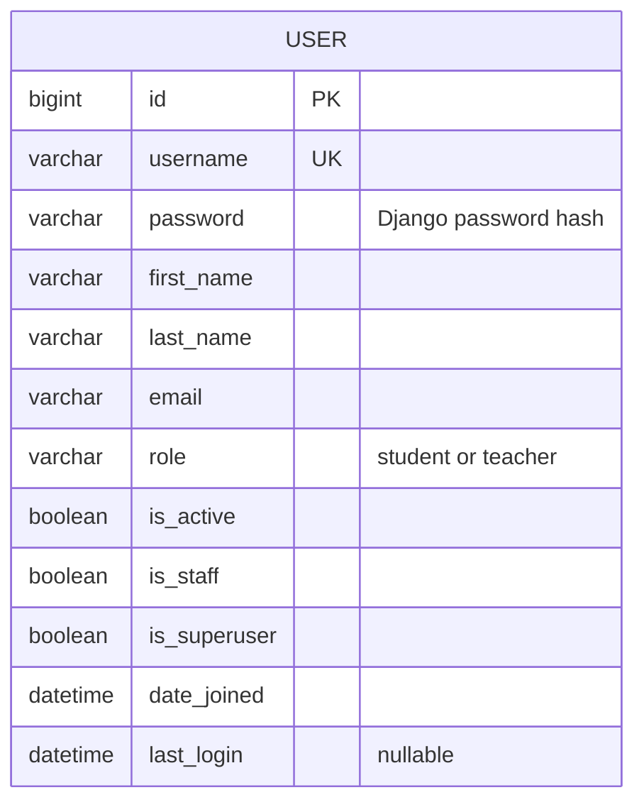

# Studyroom — CM3035 Final Coursework

Working draft. This report describes the features implemented so far; later sections will grow with the application.

## 1. Introduction and development approach

Studyroom is an eLearning application being built with Django. The coursework requires student and teacher accounts, course enrolment and materials, feedback, notifications, a user REST interface and real-time chat. The first development step establishes accounts and authentication, since the later features need to know who is making a request and what that person may do.

I am developing the application in small working steps. Each milestone adds its tests and updates this report, so the design explanations can be checked against the implementation. The main browser pages will use Django templates and forms, with JavaScript where interaction requires it. The JSON interface will live separately in `api.py` and `serializers.py`, following the organisation used in my midterm.

## 2. Accounts and database design

The first model is `accounts.User`, which extends Django's `AbstractUser`. It retains Django's username, password, name and email fields and adds a `role` field with two values: student and teacher. One field makes the two account types mutually exclusive. The field choices validate form input; a database check constraint also rejects other role values when a write bypasses a form.

The custom user was configured before the first migration. Changing the user model after courses and messages reference it would require changing those relationships and potentially moving existing account data. `AbstractUser` keeps the standard authentication behaviour while allowing the additional field [1]. The admin extends `UserAdmin`, including the role on both its creation and editing forms.

The ER diagram below shows the application model currently implemented. Django also supplies authentication and session tables. Course relationships will be added to the diagram when their models exist; the inherited authentication tables are omitted here to keep the application design readable.



## 3. Registration, authentication and permissions

Public registration creates student accounts. Teacher accounts are created or promoted through the admin, because letting a registrant choose teacher would also let them grant themselves access to student records. The registration form extends `UserCreationForm` and explicitly lists username, first name, last name and email. It does not accept role or administration flags. The password fields and validation come from Django. After saving a valid account, the view redirects to login and displays a confirmation; invalid input returns the bound form with field errors.

Login and logout use Django's built-in views and session authentication. Logout is a POST form with a CSRF token. Keeping the built-in login view also preserves its validation of the `next` destination: a user can return to a requested local page without the application redirecting them to an arbitrary external address supplied in the request.

The first teacher function is a paginated list of active student accounts. It shows username and real name, but not email or password information. Anonymous requests go to login; authenticated students receive 403. The template hides the student-list link from students, but the view checks the role independently, so entering the URL directly does not bypass the restriction. Teacher status is separate from `is_staff`: teachers have application permissions, while the staff flag controls entry to Django admin.

At this stage the list covers active students across the site. Later course rosters will be restricted to the owning teacher's courses. The landing page currently confirms the logged-in account and role; it is not yet the discoverable profile page required by the finished application.

## 4. Testing

The first milestone has 22 tests in `accounts/tests.py`, run with `python manage.py test`. They use DRF's `APITestCase` and factory_boy, following the test structure from my midterm. The current routes return HTML; REST endpoint tests will be added with the API. Factories provide predictable names and passwords, and each test overrides only the values relevant to its case.

Registration tests check stored names and email, password hashing, duplicate usernames, missing fields and invalid passwords. A tampered request includes a teacher role and both admin flags, then checks that the resulting account is still an ordinary student. Authentication tests cover both roles, incorrect credentials, inactive accounts, permitted local redirects and rejection of an external redirect. Logout tests check that GET does not end the session and that POST does.

The normal test client does not enforce CSRF. Separate cases therefore use `APIClient(enforce_csrf_checks=True)` to check rejected requests without tokens and successful registration/logout with tokens. Permission tests exercise anonymous and student requests to the student list, including a student with the staff flag. They also check that teachers cannot enter admin, inactive students are excluded, private fields are absent and pagination does not repeat rows between pages. The admin creation test submits the actual teacher form. A direct database write with an invalid role checks the constraint independently of form validation.

All 22 tests passed at the end of this milestone. Django's system check also passed, and `makemigrations --check --dry-run` reported no missing migrations. These are server-side checks; they do not establish browser layout quality, concurrency behaviour or the permissions of features that have not been implemented yet.

## 5. Current local setup

The project uses a separate Python 3.12.9 environment. The existing `advancedwebdevelopment` environment contained Python 3.14.4 and Django 6.0.4, so using it would not have matched the intended stack. Installed direct dependencies for this milestone are Django 5.2.17, djangorestframework 3.18.1 and factory_boy 3.3.3. Django 5.2 was selected as the supported LTS alternative to the originally proposed 5.1 series [2]. Exact release dependencies will be captured in `requirements.txt` for the clean-install rehearsal.

From the project directory, activate the existing local environment and run:

```sh
source .venv/bin/activate
python manage.py migrate
python manage.py runserver
```

Open `http://127.0.0.1:8000/`. Registration is at `/accounts/register/`, login at `/accounts/login/`, the teacher student list at `/students/`, and administration at `/admin/`. Run the tests with `python manage.py test`; no demo-data loading is required for tests.

The local database currently contains these demonstration accounts:

| Username | Account |
| --- | --- |
| alex | Student, Alex Wood |
| sam | Student, Sam Reed |
| morgan | Teacher, Morgan Shaw |
| admin | Site administrator |

Their local demonstration password is `Studyroom-demo-482!`. They were created through Django's user model, with `set_password` used to store hashed passwords. A repeatable loader will be introduced once the course demo data has a settled shape. The database is excluded from Git but will be included, together with the required media, in the submission ZIP. The virtual environment will be excluded from that ZIP.

## 6. Deployment plan

Deployment has not been carried out. It remains a separate milestone after integration testing. The host must support the eventual ASGI application, WebSocket connections, Redis, a Celery worker and persistent storage. The hosting choice will be justified against those needs and current costs when it is made. The deployed application will be checked for HTTPS/WSS, account permissions, material access and persistence across restarts, and the actual commands and results will replace this planning paragraph.

## References

1. Django documentation, [Substituting a custom User model](https://docs.djangoproject.com/en/5.2/topics/auth/customizing/#substituting-a-custom-user-model).
2. Django, [Supported versions](https://www.djangoproject.com/download/#supported-versions).

## 7. Critical evaluation — notes from milestone 1

The account foundation reuses Django's password and session handling, leaving a small amount of application-specific code to inspect. The tests demonstrate that the role difference is enforced on a real page and cannot be selected through registration. Using one role field is sufficient for the coursework's two account types, but it would need reconsideration if a person could teach some courses and attend others as a student.

Admin-managed teacher registration gives a clear permission boundary at the cost of manual administration. The current implementation does not verify ownership of email addresses or add login rate limiting. First and last names are required by registration but remain optional on Django's admin form. These are specific limits of the present account workflow, not claims that the whole application is ready for production. The final evaluation will revisit these choices alongside evidence from courses, uploads, chat and deployment.
