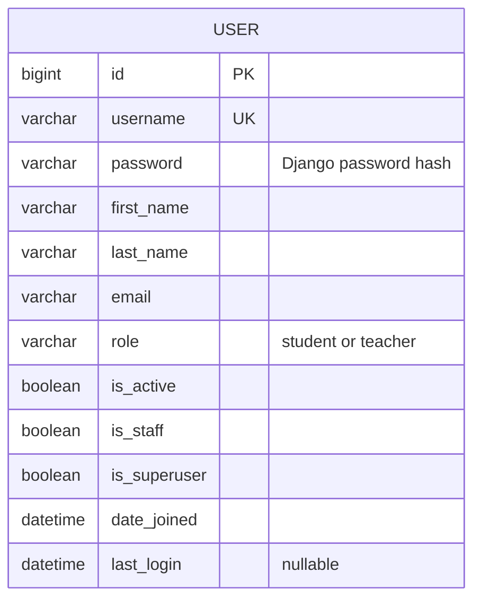

# Studyroom — CM3035 Final Coursework

Working draft. This report describes the features implemented so far; later sections will grow with the application.

## 1. Introduction and development approach

Studyroom is an eLearning application being built with Django. The coursework requires student and teacher accounts, course enrolment and materials, feedback, notifications, a user REST interface and real-time chat. The first development step establishes accounts and authentication, since the later features need to know who is making a request and what that person may do.

I am developing the application in small working steps. Each milestone adds its tests and updates this report, so the design explanations can be checked against the implementation. The main browser pages will use Django templates and forms, with JavaScript where interaction requires it. The JSON interface will live separately in `api.py` and `serializers.py`, following the organisation used in my midterm.

## 2. Accounts and database design

The first model is `accounts.User`, which extends Django's `AbstractUser`. It retains Django's username, password, name and email fields and adds a `role` field with two values: student and teacher. One field makes the two account types mutually exclusive. The field choices validate form input; a database check constraint also rejects other role values when a write bypasses a form.

The custom user was configured before the first migration. Changing the user model after courses and messages reference it would require changing those relationships and potentially moving existing account data. `AbstractUser` keeps the standard authentication behaviour while allowing the additional field [1]. The admin extends `UserAdmin`, including the role on both its creation and editing forms.

The ER diagram below shows the application model currently implemented. Django also supplies authentication and session tables. Course relationships will be added to the diagram when their models exist; the inherited authentication tables are omitted here to keep the application design readable.

## References

1. Django documentation, [Substituting a custom User model](https://docs.djangoproject.com/en/5.2/topics/auth/customizing/#substituting-a-custom-user-model).
