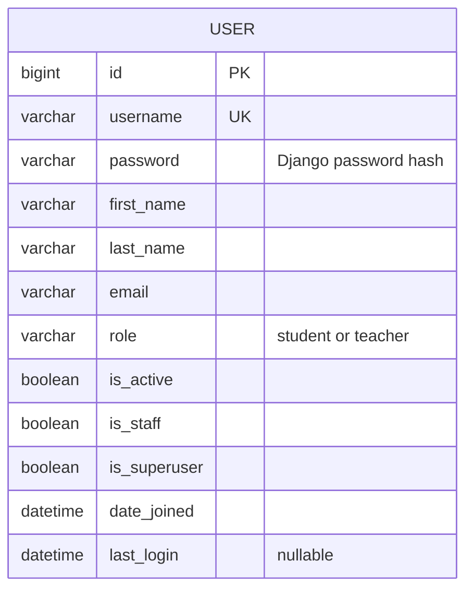

# Studyroom — CM3035 Final Coursework

> Draft status: accounts milestone complete. Profiles, courses, notifications, chat, REST endpoints and deployment are still pending. This note tracks work remaining and is not part of the submission text.

## 1. Introduction and development approach

Studyroom is an eLearning application being built with Django. The coursework requires student and teacher accounts, course enrolment and materials, feedback, notifications, a user REST interface and real-time chat. The first development step establishes accounts and authentication, since the later features need to know who is making a request and what that person may do.

Development started with the project skeleton, then the custom user and migration, registration, and login/logout. The teacher student list provided the first place to test different permissions. The browser pages use Django templates and forms, with views in `views.py` and registration validation in `forms.py`.

## 2. Accounts and database design

The first model is `accounts.User`, which extends Django's `AbstractUser`. It retains Django's username, password, name and email fields and adds a `role` field with two values: student and teacher. One field makes the two account types mutually exclusive. The field choices validate form input; a database check constraint also rejects other role values when a write bypasses a form.

The study guide's authentication example uses a separate profile model linked one-to-one to Django's user. It also discusses defining a custom user before the first migration. I chose that option because the role belongs to the account and is needed whenever permissions are checked. `AbstractUser` keeps the standard authentication behaviour while allowing the additional field [1]. Configuring it before the first migration avoids replacing the user table once other models reference it. The admin extends `UserAdmin`, including the role on both its creation and editing forms.

`TextChoices` and `CheckConstraint` are small additions to the guide's model examples. `TextChoices` keeps the stored role values and their display labels together, while the constraint enforces the two-value rule in SQLite. Neither replaces the permission checks in the views.

The ER diagram shows the current account fields. Django's supporting authentication and session tables are omitted; this diagram focuses on the application model.



## 3. Registration, authentication and permissions

Public registration creates student accounts. Teacher accounts are created or promoted through the admin, because letting a registrant choose teacher would also let them grant themselves access to student records. The registration form extends `UserCreationForm` and explicitly lists username, first name, last name and email. It does not accept role or administration flags. The password fields and validation come from Django. After saving a valid account, the view redirects to login and displays a confirmation; invalid input returns the bound form with field errors.

Login and logout use Django's built-in views and session authentication. Logout is a POST form with a CSRF token. Keeping the built-in login view also preserves its validation of the `next` destination: a user can return to a requested local page without the application redirecting them to an arbitrary external address supplied in the request.

The first teacher function is a paginated list of active student accounts. It shows username and real name, but not email or password information. Anonymous requests go to login; authenticated students receive 403. The template hides the student-list link from students, but the view checks the role independently, so entering the URL directly does not bypass the restriction. Teacher status is separate from `is_staff`: teachers have application permissions, while the staff flag controls entry to Django admin.

The list covers active students across the site. Django's `Paginator` divides it into pages of 25, keeping the rendered table bounded as accounts are added. My midterm used DRF pagination; this page uses the HTML equivalent. `require_safe` limits the list to GET and HEAD requests. Both are small framework additions to the guide's view examples. The forms use `as_div` to render Django's fields and errors inside containers styled by the stylesheet.

## 4. Testing

The account suite has 23 tests in `accounts/tests.py`, run with `python manage.py test`. They use DRF's `APITestCase` and factory_boy, following the test structure from my midterm. The routes tested here return HTML. Factories provide predictable names and passwords, and each test overrides the values relevant to its case. The factory's `Password` helper hashes the test password so the login tests exercise real authentication.

Registration tests check stored names and email, password hashing, duplicate usernames, missing fields and invalid passwords. A tampered request includes a teacher role and both admin flags, then checks that the resulting account is still an ordinary student. Authentication tests cover both roles, incorrect credentials, inactive accounts, permitted local redirects and rejection of an external redirect. Logout tests check that GET does not end the session and that POST does.

The normal test client does not enforce CSRF. Separate cases therefore use `APIClient(enforce_csrf_checks=True)` to check rejected requests without tokens and successful registration/logout with tokens. Permission tests exercise anonymous and student requests to the student list, including a student with the staff flag. They also check that teachers cannot enter admin, inactive students are excluded, private fields are absent and pagination does not repeat rows between pages. The admin creation test submits the actual teacher form. A direct database write with an invalid role checks the constraint independently of form validation.

The original 22 tests passed. A review then separated incorrect-password and inactive-account checks into two tests so a failure identifies the affected behaviour directly. All 23 tests passed after that change. Django's system check passed, and `makemigrations --check --dry-run` reported no missing migrations. Browser layout and concurrent requests need separate checks.

## 5. Current local setup

The project uses a separate Python 3.12.9 environment. The existing `advancedwebdevelopment` environment contained Python 3.14.4 and Django 6.0.4, so using it would not have matched the intended stack. Installed direct dependencies for this milestone are Django 5.2.17, djangorestframework 3.18.1 and factory_boy 3.3.3. Django 5.2 was selected as the supported LTS alternative to the originally proposed 5.1 series [2]. Exact release dependencies will be captured in `requirements.txt` for the clean-install rehearsal.

From the project directory, activate the existing local environment and run:

```sh
source .venv/bin/activate
python manage.py migrate
python manage.py runserver
```

Open `http://127.0.0.1:8000/`. Registration is at `/accounts/register/`, login at `/accounts/login/`, the teacher student list at `/students/`, and administration at `/admin/`. Run the tests with `python manage.py test`; no demo-data loading is required for tests.

The local database currently contains these demonstration accounts:

| Username | Account |
| --- | --- |
| alex | Student, Alex Wood |
| sam | Student, Sam Reed |
| morgan | Teacher, Morgan Shaw |
| admin | Site administrator |

Their local demonstration password is `Studyroom-demo-482!`. They were created through Django's user model, with `set_password` used to store hashed passwords. A repeatable loader will be introduced once the course demo data has a settled shape. The database is excluded from Git but will be included, together with the required media, in the submission ZIP. The virtual environment will be excluded from that ZIP.

## 6. Deployment plan

> Planning note: deployment follows integration testing. Compare hosts for ASGI/WebSocket support, Redis, a Celery worker, persistent storage and cost. Record the chosen configuration and verify HTTPS/WSS, permissions, uploads and persistence across restarts. No host has been selected or deployment carried out.

## References

1. Django documentation, [Substituting a custom User model](https://docs.djangoproject.com/en/5.2/topics/auth/customizing/#substituting-a-custom-user-model).
2. Django, [Supported versions](https://www.djangoproject.com/download/#supported-versions).

## 7. Critical evaluation — notes from milestone 1

The account foundation reuses Django's password and session handling, leaving a small amount of application-specific code to inspect. The tests demonstrate that the role difference is enforced on a real page and cannot be selected through registration. Using one role field is sufficient for the coursework's two account types, but it would need reconsideration if a person could teach some courses and attend others as a student.

Creating teachers through admin prevents self-assignment of teacher privileges, but each new teacher needs an administrator's action. Email format is checked, but ownership of the address is not verified. Login also has no application-level rate limiting. First and last names are required by registration but remain optional on the admin form, so an administrator can create incomplete records. These are limits to address before using the account workflow for real students.
